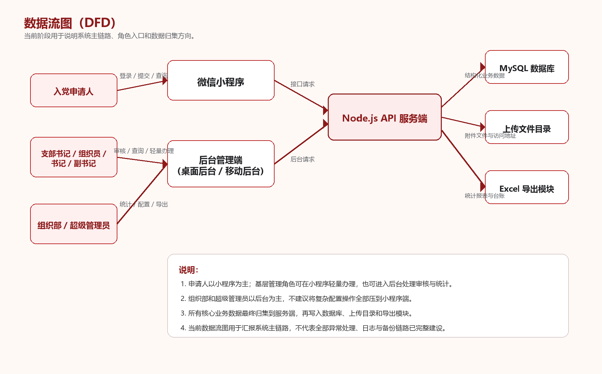
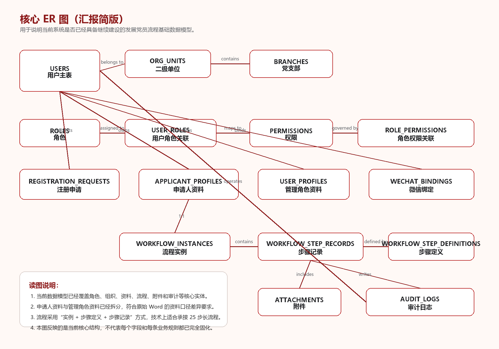

# 一、汇报说明

本报告用于汇报当前党务管理小程序项目的阶段性进展，重点说明以下内容：

1. 当前需求来源与约束条件。
2. 现阶段系统已经具备的能力、尚未具备的能力以及不能夸大说明的边界。
3. 项目技术路线的可行性判断。
4. 小程序、后台、服务端、部署、运维等方面的具体需求。
5. 当前阶段可采用的部署方式与年度成本区间。
6. 当前技术难点、需求模糊点、风险点及下一步建议。

本报告坚持保守口径。凡未完成稳定联调、未完成正式环境验证、未形成清晰验收标准的功能，均不视为“已达到正式上线条件”。

# 二、需求来源与判断口径

本报告的判断依据主要来自以下三部分：

1. 原始设计要求文档《党员发展流程.docx》。
2. 当前代码仓库中的项目说明、部署文档、进展记录、数据流图与 ER 图。
3. 当前已实现的代码结构与配置状态，包括小程序、服务端、桌面后台、移动后台的真实代码。

根据原始设计要求，项目的核心目标不是做一般性的宣传展示，而是要围绕“发展党员全流程规范化管理”提供：

1. 多角色登录与注册。
2. 发展党员 25 个步骤的顺序化办理与留痕。
3. 按本人、本支部、本单位、全校等层级进行权限控制。
4. 材料上传、审核、统计、导出。
5. 支持 PC 端后台管理。
6. 小程序界面、流程提示、颜色与风格保持正式、规范、统一。

需要强调的是，原始文档更接近“业务设计要求”和“界面方向说明”，不是完整的制度规则手册。当前仍存在若干业务判断口径未完全明确的情况，例如：个别流程节点是否允许退回重填、Excel 导入模板的最终字段边界、组织员与书记权限边界细则、正式投用前的数据审计深度等。

# 三、当前阶段实现情况

## 3.1 已经具备的基础能力

从代码结构和联调情况看，当前项目已经具备以下基础：

1. 已形成前后端分离结构：
   - 微信小程序端。
   - Node.js 服务端。
   - 桌面后台前端。
   - 移动后台前端。
2. 服务端已具备 MySQL + JWT 的基础部署形态。
3. 已有发展党员流程的通用数据模型：
   - 用户、角色、权限、组织、支部。
   - 申请人资料与管理角色资料。
   - 流程实例、步骤定义、步骤记录。
   - 附件、审计日志、微信绑定骨架。
4. 已具备后台查看、统计、导出、流程配置等基础页面结构。
5. 已实现小程序演示模式，可用于功能走查和流程讲解。
6. 已初步形成桌面后台与移动后台分开建设、统一入口分流的技术方案。

## 3.2 已完成但仍属于“可演示/可联调”层面的部分

以下内容可以视为“已有实现”，但不建议在汇报中表述为“已经达到正式投用标准”：

1. 小程序业务页框架已经搭建，能够展示流程、资料、步骤详情等页面。
2. 后台管理端已经能够承载工作台、台账、审核、统计、导出、流程配置等基本入口。
3. 服务端已经可以支撑登录、申请人列表、流程记录、部分统计与导出。
4. 移动后台已经单独重建，但仍属于继续联调和持续打磨阶段。
5. HTTPS 域名、反向代理、WebView 入口、frp 穿透等方案已经跑通过部分链路，但仍需稳定性回归。

## 3.3 当前仍不能保守认定为“已完成”的部分

以下事项目前不应在汇报中描述为“已经完全实现”：

1. 25 个流程节点尚未逐项完成正式字段校验、正式表单固化和正式验收。
2. 微信快捷登录/微信绑定仍只有数据模型与接口骨架，尚未完成真实小程序配置联调。
3. 小程序当前默认仍保留演示模式配置，不应被误认为已经完全服务端化投产。
4. 移动后台和桌面后台虽已拆分，但移动端体验和流程清晰度仍在持续整改。
5. 正式上线所需的安全、日志、备份、容灾、操作审计、异常告警等能力仍明显不足。
6. 针对书记、副书记、组织员、支部书记等角色的实际业务口径，尚缺最终逐项确认。

# 四、技术可行性评估

## 4.1 总体判断

从现有需求和现有实现看，本项目在技术上**可行**，但当前更准确的表述应为：

> “已具备继续建设和开展内部联调的可行性，具备形成试运行版本的技术基础，但距离正式验收和正式投用仍有明显差距。”

## 4.2 技术路线为什么可行

当前技术路线为：

1. 小程序端：承接申请人和基层角色的移动入口。
2. 服务端：Node.js + Express + MySQL，负责认证、权限、流程、统计、导出、上传。
3. 后台端：
   - 桌面后台：用于完整台账、配置、统计和导出。
   - 移动后台：用于微信手机端和移动浏览器中的轻量管理。

这条路线可行，原因主要有三点：

1. 需求本质上属于“流程管理 + 权限管理 + 台账统计 + 附件管理”，不属于超高并发或超复杂计算场景，常规 Web 技术栈可以承接。
2. 25 步流程虽然长，但逻辑类型相对稳定，适合采用“步骤定义 + 步骤记录”的统一建模方式，而不是为每一步单独建一套系统。
3. 微信小程序对“轻交互、表单、审核、材料上传、流程查询”的承载能力是足够的；复杂配置和统计则放在后台端更合理。

## 4.3 技术可行但不能乐观估计的部分

技术可行不代表短期即可稳定落地。当前不能过于乐观的点主要包括：

1. 需求边界尚未完全定稿，尤其是角色边界和节点表单字段。
2. 小程序正式上线依赖 HTTPS、合法域名、微信平台配置、备案等外部条件。
3. 后台移动端目前尚处于重建与修正阶段，不能按“成熟系统”对外表述。
4. 发展党员工作本身具有较强规范性，真正投用前需要业务部门对字段、流程、导入模板、审计要求逐条确认。
5. 涉及身份证号、政治面貌、家庭成员、社会关系等敏感信息，正式投用前的安全和合规要求会明显高于演示环境。

# 五、具体需求梳理

## 5.1 角色与登录注册需求

依据原始设计要求，系统至少需要覆盖以下角色：

1. 入党申请人。
2. 二级单位党委（总支）书记、副书记、组织员、党支部书记。
3. 校党委组织部负责人员。
4. 超级管理员。

其中：

1. 超级管理员不走普通注册流程。
2. 其他角色首次登录前需要进行注册或由后台导入和审核。
3. 入党申请人注册后需要补充完整个人资料。
4. 管理角色资料不应等同于申请人资料，应采用不同字段口径。

## 5.2 申请人资料需求

原始文档对申请人资料要求较细，核心包括：

1. 基础身份信息。
2. 学历与职业信息。
3. 政治历史与个人简历。
4. 家庭主要成员与主要社会关系。
5. 奖惩情况。

这意味着系统正式投用前，不能只停留在“姓名、电话、学历”这种简化表单层面，而需要明确：

1. 每个字段是否必填。
2. 哪些字段可由身份证号自动推导。
3. 哪些字段需要固定词表或标准格式。
4. 哪些字段需要在后续节点中再次引用。

## 5.3 流程管理需求

原始文档要求系统覆盖三个阶段共 25 个步骤，并且具有以下共同约束：

1. 上一步未完成，下一步不能开启。
2. 管理员可设置步骤时间区间。
3. 超出办理窗口后，申请人不能自行修改或提交。
4. 管理员可以查看全部提交与修改时间。
5. 材料上传应支持图片等附件形式。
6. 关键步骤涉及审核通过、拒绝、退回、身份变化。

这说明正式需求不仅是“展示 25 个节点”，还包括：

1. 顺序控制。
2. 时间控制。
3. 角色控制。
4. 附件控制。
5. 审核留痕。
6. 身份阶段变更。

## 5.4 后台管理需求

根据原始要求和当前代码结构，后台端至少需要满足：

1. 查看本支部、本单位、全校范围内的人员与流程数据。
2. 审核注册信息。
3. 审核流程节点。
4. 导入管理员与组织角色的 Excel 数据。
5. 统计并导出 Excel 报表。
6. 维护组织、支部、角色和流程配置。

## 5.5 非功能性需求

正式系统还需要至少满足以下非功能性要求：

1. HTTPS 域名与备案。
2. 数据库备份与恢复。
3. 操作日志留痕。
4. 敏感信息访问控制。
5. 错误告警和服务监控。
6. 账号密码安全策略。
7. Excel 模板版本管理。

# 六、部署方式、服务成本与运维成本分析

## 6.1 部署所需的基础资源

无论采用哪种部署方案，小程序正式联调或正式上线都至少需要以下基础条件：

1. 中国内地可用的服务器资源或校内可用服务器资源。
2. HTTPS 域名。
3. 备案条件满足。
4. MySQL 数据库。
5. 后台前端静态托管与反向代理。
6. 上传目录与备份策略。

从腾讯云当前公开页面看：

1. 轻量应用服务器已经明确提供适用于“小程序/小游戏后端和 Web 开发场景”的 2 核 4GB / 100GB 规格，公开页面展示价格为 `100 元/月` 或 `1020 元/年（85折）`。[1]
2. 4 核 8GB / 180GB 规格公开页面展示价格为 `245 元/月` 或 `2499 元/年（85折）`。[1]
3. 免费 SSL 证书有效期 90 天，官方明确说明“仅作为前期测试使用”，正式项目建议使用正式证书。[2]
4. 腾讯云备案文档明确说明：使用中国内地云资源绑定域名访问前，需要满足备案条件；备案本身不应理解为正式部署的主要现金成本，但会带来时间成本和材料准备成本。[3]

## 6.2 两种较现实的部署方案

### 方案 A：低成本试运行方案

适用前提：

1. 以校内试运行、内部演示、需求核实为主。
2. 允许应用服务、Nginx、MySQL 共用一台服务器。
3. 可以接受运维风险较高、扩展能力有限。

建议组成：

1. 1 台 2 核 4GB / 100GB 左右的云主机或轻量应用服务器。
2. 同机部署 Nginx、Node.js 服务端、MySQL。
3. 使用正式域名。
4. 测试期可用免费 SSL；若进入正式试运行，建议改用正式证书。

保守成本判断：

1. 服务器成本：约按 `1020 元/年` 这一公开页面规格作为参考下限。[1]
2. 域名与证书：视域名后缀、购买渠道和证书类型而定，不宜按零成本理解。
3. 若使用免费证书，应考虑 90 天周期更换和证书管理工作量。[2]

综合判断：

> 该方案现金成本最低，但不建议直接作为长期正式方案。其优点是落地快、便于试运行；缺点是数据库、应用、上传文件在同一节点，运维和安全风险偏高。

### 方案 B：较稳妥的正式试运行方案

适用前提：

1. 计划进入较稳定的校内试运行。
2. 需要降低数据库运维和备份压力。
3. 希望后续具备继续扩展的基础。

建议组成：

1. 1 台应用服务器：
   - 可按 2 核 4GB 或 4 核 8GB 规格起步。[1]
2. 1 套托管 MySQL 数据库服务：
   - 使用云厂商托管数据库，而不是长期自建数据库。
3. 正式 SSL 证书。
4. 独立上传目录与定期备份。
5. 监控、日志与错误告警。

保守成本判断：

1. 若应用服务器采用 2 核 4GB 级别，年成本可参考 `1020 元/年` 起步；若采用 4 核 8GB 级别，则可参考 `2499 元/年` 起步。[1]
2. 托管 MySQL 的具体价格需以当期购买页配置为准；腾讯云官方产品页明确表述，云数据库 MySQL 提供分钟级部署、自动化运维、备份、高可用等能力，但价格会明显高于自建 MySQL。[4]
3. 正式 SSL 证书存在额外成本；免费证书不建议作为正式项目长期方案。[2]

综合判断：

> 该方案的现金成本明显高于单机方案，但数据库稳定性、备份能力、扩展能力和运维可控性更好，更适合作为校内试运行或正式建设前的保守方案。

## 6.3 运维成本分析

无论采用哪种方案，运维成本都不能只看“服务器买一台即可”。

至少需要承担以下工作：

1. 域名、证书、备案和到期管理。
2. MySQL 备份与恢复演练。
3. 上传文件目录备份。
4. 系统补丁与安全更新。
5. 用户登录故障、配置错误、反向代理问题排查。
6. 导出报表、导入模板变更、角色权限调整。

从项目实际情况看，运维成本主要不是高并发压力，而是：

1. 配置项较多。
2. 域名、反代、微信平台配置之间的耦合较强。
3. 流程与权限规则一旦修改，往往会影响小程序、后台和服务端三端联动。

因此，若进入试运行，建议至少明确：

1. 有固定责任人负责配置和回归测试。
2. 有月度备份检查机制。
3. 有简单的故障登记和回滚预案。

## 6.4 成本结论

较保守的判断是：

1. 若只是做内部演示和短期试运行，单机方案可以支撑，但不应按此方案承诺长期稳定投用。
2. 若要进入比较严肃的校内试运行，建议至少采用“应用服务 + 更规范的数据库与备份”方案。
3. 若校内已有可复用服务器、数据库、域名和运维资源，现金成本会明显下降，但运维责任并不会消失。

# 七、数据流图

以下数据流图采用正式插图方式表达，重点体现当前项目的业务数据主链路。

图示说明：

1. 申请人以小程序为主。
2. 基层管理角色既可在小程序轻量查看，也可在后台办理审核、统计和导出。
3. 组织部和超级管理员主要依赖后台。
4. 所有核心数据最终归集到服务端、数据库、附件目录和导出模块。

# 八、ER 图

以下 ER 图为当前项目的核心实体关系简图，用于说明系统是否具备继续建设的数据库基础。

图示说明：

1. 角色权限、组织结构和流程记录已经有基础建模。
2. 申请人资料与管理角色资料已经分开建模，这一点符合原始需求的方向。
3. 25 步流程通过“流程实例 + 步骤定义 + 步骤记录”方式承载，技术上可继续扩展。

# 九、当前技术难点与需求模糊点

## 9.1 25 个步骤的字段边界仍不够清晰

原始 Word 文档明确了 25 个步骤和若干关键节点，但没有把每一步的全部字段、字段格式、是否可退回、是否可补填、导入模板列头等细节完全定稿。  
若不先完成这部分梳理，后续会出现“页面做出来了，但业务部门仍认为不符合流程要求”的情况。

## 9.2 角色边界与组织层级仍需进一步固化

例如：

1. 书记、副书记、组织员是否都具备完全相同的数据导出权限。
2. 党支部书记是否只限本支部查看，还是也可以参与部分单位级审核。
3. 超级管理员与单位管理员之间的边界是否需要更细化。

这些问题如果不在需求阶段明确，后续容易频繁返工。

## 9.3 Excel 导入导出模板尚需制度化

当前原始要求明确提出可通过 Excel 导入管理角色和部分结果，但尚未形成正式模板治理机制。  
正式投用前至少应明确：

1. 模板字段。
2. 字段命名。
3. 模板版本号。
4. 错误反馈规则。

## 9.4 敏感信息安全要求较高

本项目涉及姓名、身份证号、家庭成员、社会关系、奖惩情况、政治历史等敏感信息。  
若进入正式使用阶段，仅有基础登录和数据库存储是不够的，仍需进一步考虑：

1. 密码安全策略。
2. 审计日志深度。
3. 数据备份和恢复。
4. 管理员最小权限。
5. 导出文件的管控。

## 9.5 小程序正式投用依赖外部条件

小程序要进入真机测试和正式投用，仍受以下条件约束：

1. HTTPS 域名和合法域名配置。
2. 备案。
3. 微信小程序平台配置。
4. WebView 业务域名。
5. 微信快捷登录所需的真实配置。

这些不是单纯写代码即可解决的问题，需要同步推进。

# 十、保守的可用性判断与验收标准建议

## 10.1 当前可用性判断

当前系统更适合被定义为：

1. 已有较完整代码结构。
2. 可用于阶段汇报。
3. 可用于内部演示。
4. 可继续开展联调和需求核实。

但不宜直接表述为：

1. 已经完成正式上线准备。
2. 已经完成全部 25 步正式验收。
3. 已经具备稳定、安全、长期可用的生产能力。

## 10.2 建议采用分阶段验收

### 第一阶段：演示验收

最低标准：

1. 主要角色可登录。
2. 25 步流程可展示。
3. 关键步骤可提交或审核。
4. 后台可查看台账与导出基础报表。

### 第二阶段：试运行验收

最低标准：

1. 全部角色权限边界明确。
2. 全部关键节点字段口径确认。
3. 导入导出模板确定。
4. HTTPS、域名、备案、备份策略可用。
5. 主要流程能走通且有审计留痕。

### 第三阶段：正式投用验收

最低标准：

1. 25 步流程字段和规则全部固化。
2. 全量角色在真实环境可稳定使用。
3. 数据备份、恢复、错误告警、账号安全达到基本要求。
4. 导出、上传、日志、权限均有明确制度边界。

# 十一、阶段性结论

综合当前原始文档要求、现有实现和现有部署能力，可以给出较保守的结论：

1. 该项目在技术路线层面是可行的。
2. 当前已经具备“继续建设、持续联调、形成试运行版本”的基础。
3. 当前还不适合被表述为“已经完成正式上线条件”。
4. 当前最大的风险不在于“能否写出来”，而在于“需求边界是否足够清晰、验收口径是否足够明确、部署与运维是否准备充分”。

因此，较稳妥的汇报口径应为：

> 项目已完成基础架构搭建与阶段性功能实现，具备继续推进的技术可行性；但当前仍需进一步明确若干业务细节、补足正式部署与安全运维条件，并通过分阶段联调和试运行逐步推进，不宜对短期内全面上线形成过高预期。

# 十二、建议的下一步工作

建议下一步按以下顺序推进，而不是继续单纯堆叠页面：

1. 先由业务部门确认 25 个步骤的字段、状态和退回口径。
2. 明确各角色权限边界与组织层级口径。
3. 固化 Excel 导入导出模板。
4. 完成 HTTPS、备案、域名、WebView 配置和真机联调。
5. 补齐备份、日志、审计和安全策略。
6. 以“试运行验收”而不是“直接正式上线”为近期目标。

# 参考依据

1. 原始设计要求：《党员发展流程.docx》。
2. 当前项目仓库中的 `README.md`、`docs/project-overview.md`、`docs/report-progress.md`、`docs/dfd.mmd`、`docs/er.mmd`。
3. 腾讯云轻量应用服务器产品页：[https://cloud.tencent.com/product/lighthouse](https://cloud.tencent.com/product/lighthouse)。
4. 腾讯云免费 SSL 证书文档：[https://cloud.tencent.com/document/product/400/89868](https://cloud.tencent.com/document/product/400/89868)。
5. 腾讯云备案云资源文档：[https://cloud.tencent.com/document/product/243/18908](https://cloud.tencent.com/document/product/243/18908)。
6. 腾讯云云数据库 MySQL 产品页：[https://cloud.tencent.com/product/cdb](https://cloud.tencent.com/product/cdb)。

---

## 参考说明

[1] 腾讯云轻量应用服务器产品页当前公开展示了 2 核 4GB / 100GB 规格约 `100 元/月`、`1020 元/年（85折）` 以及 4 核 8GB / 180GB 规格约 `245 元/月`、`2499 元/年（85折）` 的参考价格。该价格具有时间敏感性，仅可作为当前阶段的公开参考，不应直接等同于最终采购价。

[2] 腾讯云免费 SSL 证书文档明确指出：免费证书有效期 90 天，仅适合前期测试使用；正式项目建议使用正式证书。

[3] 腾讯云备案文档明确指出：若在中国内地使用云资源提供域名访问服务，需要满足备案条件。备案本身不是本项目主要的功能开发成本，但会带来手续、时间和配置成本。

[4] 腾讯云云数据库 MySQL 官方产品页说明托管数据库可提供分钟级部署、自动化运维、备份、高可用等能力。由于具体价格与规格、地域、架构有关，本报告不直接采用单一固定价格，而仅将其作为“较稳妥方案成本明显高于自建数据库”的依据。
